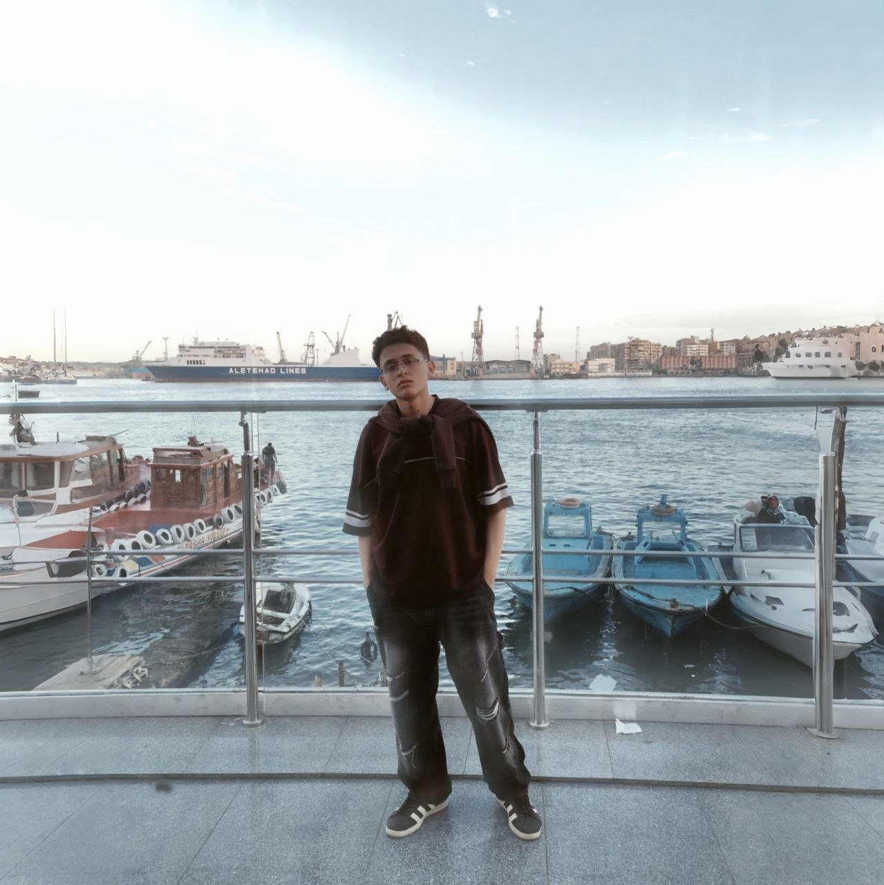

# 🌐 Adam Al Zoghby — Personal Portfolio

<div align="center">



[](https://snickkers287.github.io/Portfolio/)
[](https://developer.mozilla.org/en-US/docs/Web/HTML)
[](https://developer.mozilla.org/en-US/docs/Web/CSS)

</div>

---

## 📌 About

This is my personal portfolio, built with pure HTML and CSS. It covers a lot about me, who I am, some of the things I've worked on, and the different things I'm into, which still, couldn't all be covered.

🔗 **Live:** [snickkers287.github.io/Portfolio](https://snickkers287.github.io/Portfolio/)

---

## ✨ Features

- Works on nearly all devices
- Animated typed text using [Typed.js](https://github.com/mattboldt/typed.js/)
- Smooth scrolling and a great functional hamburger menu for the phones
- Project cards with poster previews
- Contact form, if you want to inquire further info [Formspree](https://formspree.io/)
- Dark navy theme as it looks great

---

## 🗂️ Sections

| Section | Description |
|---|---|
| **Hero** | First thing you see, telling you who I am |
| **About** | More about me |
| **Skills** | The stuff I find myself great with |
| **Projects** | 6 projects (more still in progress), ranging from physical builds to data analysis to a game, and my favourite, IoT|
| **Contact** | Follow me on the socials if you want or send me sth|

---

## 🚀 Projects Featured

- 🌉 **Vertical Lift N-Truss Bridge** — Built from palm midrib, holds 80kg while weighing only 5kg, and lastly, opens and closes to pass things beneath
- ⚡ **E-Waste Digital Ohmmeter** — Made from salvaged components, programmed on ATmega, 96.8% accuracy
- 🌱 **IoT Smart Greenhouse** — ETo-driven irrigation with automated climate control, real-time monitoring, and more great things
- 🎮 **Rhythm Ravage** — A rhythm game I made in Godot, try it on itch.io
- 📊 **Global Layoffs Analysis** — Data cleaning and analysis on COVID-era layoffs using MySQL
- 🔋 **Direct Carbon Fuel Cell** *(In Progress)* — Independent research I'm currently working on

---

## 🛠️ Built With

- HTML5 & CSS3 — everything structural and visual
- [Typed.js](https://github.com/mattboldt/typed.js/) — the typing animation in the hero
- [Font Awesome 6](https://fontawesome.com/) — all the icons
- [Google Fonts — Poppins](https://fonts.google.com/specimen/Poppins) — the font
- [Formspree](https://formspree.io/) — handles the contact form submissions
- GitHub Pages — where it's hosted

---

## 📁 Folder Structure

```
Portfolio/
├── index.html
├── style.css
└── assets/
    ├── images/
    │   └── main_photo.jpg
    └── posters/
        ├── bridge.pdf
        ├── ohmmeter.pdf
        ├── greenhouse.pdf
        └── greenhouse_schematic.pdf
```

---

## 📬 Contact

**Adam Al Zoghby**
📧 [adamyoussef1082@gmail.com](mailto:adamyoussef1082@gmail.com)
💼 [LinkedIn](https://www.linkedin.com/in/adam-youssef-al-zoghby-65a678333)
🐙 [GitHub](https://github.com/Snickkers287)
📸 [Instagram](https://www.instagram.com/__adam_zoghby__/)

---
###Note: 
This portfolio isn't currently complete, and won't be anytime soon, as long as I'm still working on new things

---

<div align="center">
  <sub>Designed & Built by <strong>Adam Al Zoghby</strong></sub>
</div>